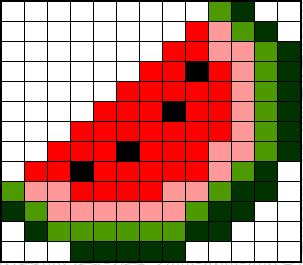
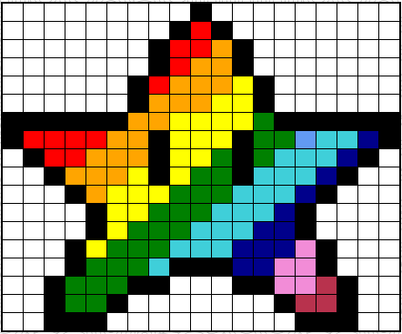
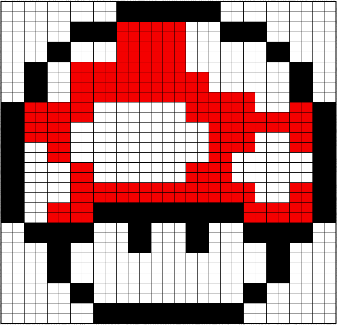

# Draw Away

This repository houses the necessary assets for the "Draw-Away" page, which contains a pixel art maker.
It enables users to make visual drawings by sizing a grid and choosing a given color for any grid's units.

### List of all needed npm commands

All commands needed are found below:

```bash
npm init
npm i node express
npm install dotenv
npm i cors
npm i http
npm install --save-dev jest
npm install node-fetch
npm i webpack webpack-cli
npm install webpack-dev-server --save-dev
npm i -D @babel/core @babel/preset-env babel-loader
npm i -D html-webpack-plugin
npm i -D clean-webpack-plugin
npm i -D style-loader node-sass css-loader sass-loader
npm install file-loader --save-dev
npm i mini-css-extract-plugin
npm install terser-webpack-plugin --save-dev
npm install --save-dev optimize-css-assets-webpack-plugin
npm install workbox-webpack-plugin --save-dev
npm install --save @babel/polyfill
npm install supertest babel-cli superagent --save-dev
```

## Visual Samples

### Sample #1



### Sample #2



### Sample #3



## Instructions

To draw on a grid, you must first select your grid's size using the "Grid Height" and "Grid Width" input.
The submit form does not take in symbols nor alphabetic letters. Thus, you must input integers, hence whole numbers,
ranging from 1 to 100. Once you have selected your grid's size, press "Submit," and a grid will appear under the
"Design Canvas" heading. To assign a color to a given unit (each unit is 20 px in width and length), you must click
on the color button under the "Pick A Color" heading. A menu will pop-up, allowing for a gradient, a range, or
manually inputting parameters representing a given color with a standard color unit system such as RGB, HSL, and HEX.
Once you have selected a color, you can click on any unit on the grid, and the grid's background color will change to
the color you specified on the "color picker." To change a unit's color, you need to select the new color you want
with the "color picker" and click once more on the grid units you wish to target. To reset all the colors of your grid
to the default color, being white, click the submit button. If you want to change your grid's size, be mindful that the
new grid will have the default color white and not inherit your previously designed grid schema.

## Tools

This webpage uses the following technologies: HTML, CSS, and JavaScript.

## License

This codebase is a public domain, so feel free to use this repo for what you want.
